# Shia Islamic Chatbot - Complete Architecture Documentation

**Version**: 1.0
**Last Updated**: 2025-10-25
**Status**: Production Ready

---

## Table of Contents

1. [System Overview](#system-overview)
2. [High-Level Architecture](#high-level-architecture)
3. [Technology Stack](#technology-stack)
4. [Project Structure](#project-structure)
5. [Data Flow & Request Lifecycle](#data-flow--request-lifecycle)
6. [Authentication & Authorization](#authentication--authorization)
7. [RAG Pipeline Architecture](#rag-pipeline-architecture)
8. [Specialized Tools System](#specialized-tools-system)
9. [Database Schema](#database-schema)
10. [API Endpoints](#api-endpoints)
11. [Service Layer](#service-layer)
12. [Security Architecture](#security-architecture)
13. [External API Integration](#external-api-integration)
14. [Observability & Monitoring](#observability--monitoring)
15. [Deployment Architecture](#deployment-architecture)
16. [Key Design Decisions](#key-design-decisions)

---

## System Overview

### What is This Application?

The **Shia Islamic Chatbot** is a comprehensive AI-powered platform that provides:
- **Intelligent Q&A**: Answers Islamic questions using RAG (Retrieval-Augmented Generation)
- **Ahkam Rulings**: Fetches authentic rulings directly from official Marja websites
- **Hadith Lookup**: Searches Islamic traditions by reference, text, or narrator
- **Prayer Times**: Calculates prayer times and Islamic calendar conversions
- **Financial Tools**: Zakat and Khums calculators with mandatory verification warnings
- **Voice Support**: Speech-to-text in 7 languages (Arabic, English, Persian, Urdu, etc.)
- **Admin Dashboard**: Complete user, content, and support management
- **External API**: Enables third-party applications to integrate

### Core Capabilities

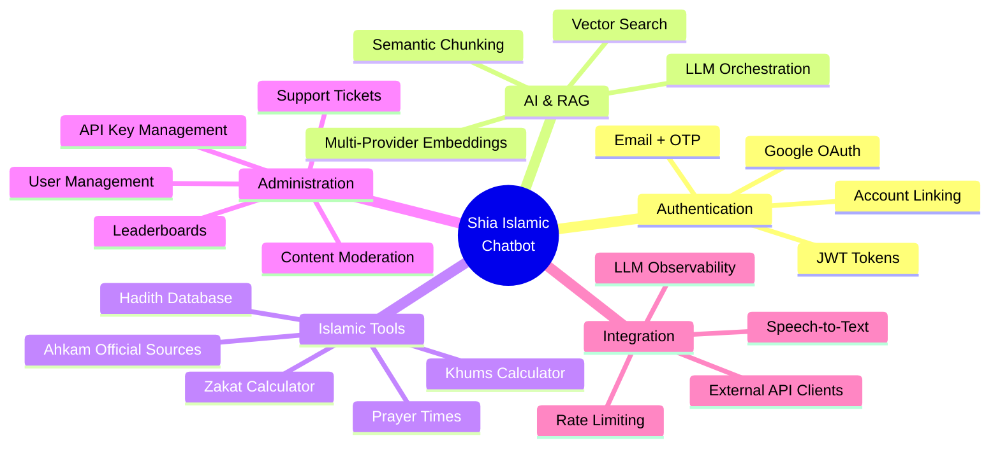
```mermaid
mindmap
  root((Shia Islamic<br/>Chatbot))
    Authentication
      Email + OTP
      Google OAuth
      Account Linking
      JWT Tokens
    AI & RAG
      Vector Search
      Semantic Chunking
      LLM Orchestration
      Multi-Provider Embeddings
    Islamic Tools
      Ahkam Official Sources
      Hadith Database
      Prayer Times
      Zakat Calculator
      Khums Calculator
    Administration
      User Management
      Content Moderation
      Support Tickets
      API Key Management
      Leaderboards
    Integration
      External API Clients
      Rate Limiting
      Speech-to-Text
      LLM Observability
```

---

## High-Level Architecture

### System Architecture Diagram

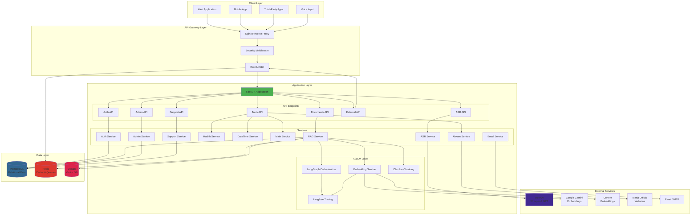
```mermaid
graph TB
    subgraph "Client Layer"
        WebApp[Web Application]
        MobileApp[Mobile App]
        ThirdParty[Third-Party Apps]
        Voice[Voice Input]
    end

    subgraph "API Gateway Layer"
        Nginx[Nginx Reverse Proxy]
        Security[Security Middleware]
        RateLimit[Rate Limiter]
    end

    subgraph "Application Layer"
        FastAPI[FastAPI Application]

        subgraph "API Endpoints"
            AuthAPI[Auth API]
            ToolsAPI[Tools API]
            DocsAPI[Documents API]
            AdminAPI[Admin API]
            SupportAPI[Support API]
            ExternalAPI[External API]
            ASRAPI[ASR API]
        end

        subgraph "Services"
            AuthService[Auth Service]
            RAGService[RAG Service]
            AhkamService[Ahkam Service]
            HadithService[Hadith Service]
            DateTimeService[DateTime Service]
            MathService[Math Service]
            AdminService[Admin Service]
            SupportService[Support Service]
            ASRService[ASR Service]
            EmailService[Email Service]
        end

        subgraph "AI/LLM Layer"
            LangGraph[LangGraph Orchestration]
            Embeddings[Embedding Service]
            Chonkie[Chonkie Chunking]
            Langfuse[Langfuse Tracing]
        end
    end

    subgraph "Data Layer"
        PostgreSQL[(PostgreSQL<br/>Relational Data)]
        Redis[(Redis<br/>Cache & Queues)]
        Qdrant[(Qdrant<br/>Vector DB)]
    end

    subgraph "External Services"
        OpenAI[OpenAI<br/>Whisper & GPT]
        Gemini[Google Gemini<br/>Embeddings]
        Cohere[Cohere<br/>Embeddings]
        MarjaWebsites[Marja Official<br/>Websites]
        SMTP[Email SMTP]
    end

    WebApp --> Nginx
    MobileApp --> Nginx
    ThirdParty --> Nginx
    Voice --> Nginx

    Nginx --> Security
    Security --> RateLimit
    RateLimit --> FastAPI

    FastAPI --> AuthAPI
    FastAPI --> ToolsAPI
    FastAPI --> DocsAPI
    FastAPI --> AdminAPI
    FastAPI --> SupportAPI
    FastAPI --> ExternalAPI
    FastAPI --> ASRAPI

    AuthAPI --> AuthService
    ToolsAPI --> AhkamService
    ToolsAPI --> HadithService
    ToolsAPI --> DateTimeService
    ToolsAPI --> MathService
    DocsAPI --> RAGService
    AdminAPI --> AdminService
    SupportAPI --> SupportService
    ExternalAPI --> RateLimit
    ASRAPI --> ASRService

    RAGService --> LangGraph
    RAGService --> Embeddings
    RAGService --> Chonkie

    LangGraph --> Langfuse
    Embeddings --> Langfuse

    AuthService --> PostgreSQL
    RAGService --> PostgreSQL
    RAGService --> Qdrant
    AdminService --> PostgreSQL
    SupportService --> PostgreSQL

    RateLimit --> Redis
    RAGService --> Redis

    AhkamService --> MarjaWebsites
    ASRService --> OpenAI
    Embeddings --> Gemini
    Embeddings --> Cohere
    EmailService --> SMTP

    style FastAPI fill:#4CAF50
    style PostgreSQL fill:#336791
    style Redis fill:#DC382D
    style Qdrant fill:#DC244C
    style OpenAI fill:#412991
```

### Component Responsibilities

| Component | Responsibility | Technology |
|-----------|---------------|------------|
| **Nginx** | Reverse proxy, SSL termination, load balancing | Nginx 1.24+ |
| **FastAPI** | HTTP server, request routing, validation | FastAPI 0.115+ |
| **Security Middleware** | XSS, SQL injection, CSRF protection | Custom Python |
| **Rate Limiter** | API rate limiting (per-minute, per-day) | Redis 7+ |
| **Auth Service** | User registration, login, JWT tokens | SQLAlchemy, JWT |
| **RAG Service** | Document processing, vector search, LLM queries | LangChain, LangGraph |
| **Specialized Tools** | Ahkam, Hadith, DateTime, Math calculations | Custom Services |
| **Admin Service** | User management, content moderation | SQLAlchemy |
| **PostgreSQL** | Relational data (users, documents, tickets) | PostgreSQL 15+ |
| **Redis** | Caching, rate limiting, session storage | Redis 7+ |
| **Qdrant** | Vector storage and similarity search | Qdrant latest |
| **Langfuse** | LLM observability and tracing | Langfuse SDK |

---

## Technology Stack

### Backend Framework

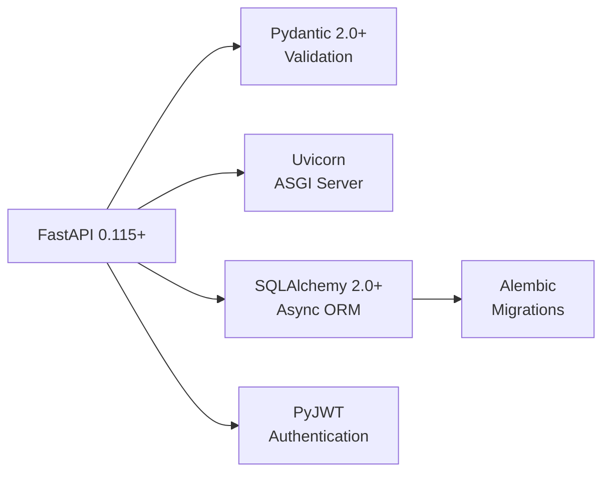
```mermaid
graph LR
    FastAPI[FastAPI 0.115+] --> Pydantic[Pydantic 2.0+<br/>Validation]
    FastAPI --> Uvicorn[Uvicorn<br/>ASGI Server]
    FastAPI --> SQLAlchemy[SQLAlchemy 2.0+<br/>Async ORM]
    SQLAlchemy --> Alembic[Alembic<br/>Migrations]
    FastAPI --> JWT[PyJWT<br/>Authentication]
```

### AI/LLM Stack

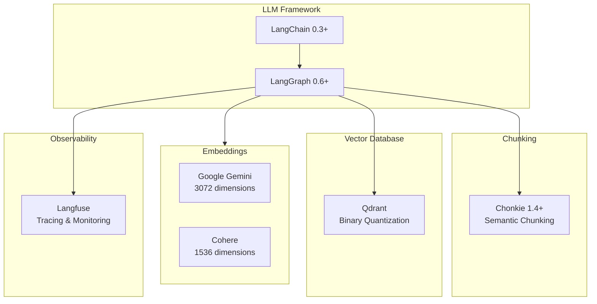
```mermaid
graph TB
    subgraph "LLM Framework"
        LangChain[LangChain 0.3+]
        LangGraph[LangGraph 0.6+]
        LangChain --> LangGraph
    end

    subgraph "Embeddings"
        Gemini[Google Gemini<br/>3072 dimensions]
        Cohere[Cohere<br/>1536 dimensions]
    end

    subgraph "Chunking"
        Chonkie[Chonkie 1.4+<br/>Semantic Chunking]
    end

    subgraph "Vector Database"
        Qdrant[Qdrant<br/>Binary Quantization]
    end

    subgraph "Observability"
        Langfuse[Langfuse<br/>Tracing & Monitoring]
    end

    LangGraph --> Embeddings
    LangGraph --> Chonkie
    LangGraph --> Qdrant
    LangGraph --> Langfuse
```

### Complete Technology List

| Category | Technologies |
|----------|-------------|
| **Backend** | Python 3.11+, FastAPI 0.115+, Uvicorn |
| **Database** | PostgreSQL 15+, SQLAlchemy 2.0 (async), Alembic |
| **Cache/Queue** | Redis 7.2+ |
| **Vector DB** | Qdrant (latest) |
| **AI/LLM** | LangChain 0.3+, LangGraph 0.6+, Chonkie 1.4+ |
| **Embeddings** | Google Gemini, Cohere |
| **LLM Providers** | OpenAI, Anthropic (Claude) |
| **Speech-to-Text** | OpenAI Whisper, Google Speech-to-Text |
| **Authentication** | JWT (PyJWT), bcrypt, Google OAuth 2.0 |
| **Observability** | Langfuse, Structured Logging |
| **Testing** | pytest, pytest-asyncio, pytest-cov |
| **Code Quality** | Black, isort, flake8, mypy, bandit |
| **Deployment** | Docker, Docker Compose, Nginx |
| **CI/CD** | GitHub Actions |

---

## Project Structure

### Directory Tree

```
shia-islamic-chatbot/
├── src/
│   └── app/
│       ├── api/
│       │   └── v1/
│       │       ├── __init__.py           # API router aggregation
│       │       ├── auth.py               # Authentication endpoints
│       │       ├── documents.py          # Document & RAG endpoints
│       │       ├── tools.py              # Specialized tools endpoints
│       │       ├── admin.py              # Admin management endpoints
│       │       ├── support.py            # Support ticket endpoints
│       │       ├── leaderboard.py        # Leaderboard endpoints
│       │       ├── external_api.py       # External API client endpoints
│       │       └── asr.py                # Speech-to-text endpoints
│       │
│       ├── core/
│       │   ├── config.py                 # Settings & configuration
│       │   ├── security.py               # JWT, password hashing
│       │   └── logging.py                # Structured logging
│       │
│       ├── db/
│       │   ├── base.py                   # SQLAlchemy base
│       │   └── session.py                # Database session management
│       │
│       ├── models/
│       │   ├── user.py                   # User, OTP, Session models
│       │   ├── document.py               # Document, Chunk, Embedding models
│       │   ├── chat.py                   # Conversation, Message models
│       │   ├── marja.py                  # Marja, Official Sources models
│       │   ├── admin.py                  # Admin, Activity Log models
│       │   ├── support_ticket.py         # Support Ticket models
│       │   └── external_api.py           # API Client, Usage Log models
│       │
│       ├── schemas/
│       │   ├── auth.py                   # Auth request/response schemas
│       │   ├── documents.py              # Document schemas
│       │   ├── tools.py                  # Tools schemas
│       │   ├── admin.py                  # Admin schemas
│       │   └── external_api.py           # External API schemas
│       │
│       ├── services/
│       │   ├── auth.py                   # Authentication business logic
│       │   ├── qdrant_service.py         # Vector DB operations
│       │   ├── chonkie_service.py        # Semantic chunking
│       │   ├── embeddings_service.py     # Multi-provider embeddings
│       │   ├── document_service.py       # Document processing
│       │   ├── langgraph_service.py      # RAG orchestration
│       │   ├── ahkam_service.py          # Ahkam from official sources
│       │   ├── hadith_service.py         # Hadith lookup
│       │   ├── datetime_service.py       # Prayer times, calendar
│       │   ├── math_service.py           # Zakat, Khums calculators
│       │   ├── tool_orchestration_service.py  # Multi-tool execution
│       │   ├── admin_service.py          # Admin operations
│       │   ├── support_service.py        # Support tickets
│       │   ├── leaderboard_service.py    # User rankings
│       │   ├── email_service.py          # Email notifications
│       │   ├── external_api_client_service.py  # API client management
│       │   ├── rate_limiter_service.py   # Rate limiting
│       │   ├── asr_service.py            # Speech-to-text
│       │   └── langfuse_service.py       # LLM observability
│       │
│       ├── middleware/
│       │   └── security.py               # Security middleware
│       │
│       └── main.py                       # Application entry point
│
├── tests/
│   ├── conftest.py                       # Test fixtures
│   ├── test_auth_service.py              # Authentication tests
│   └── integration/                      # Integration tests
│
├── alembic/
│   ├── versions/                         # Migration files
│   │   └── create_indexes.py             # Performance indexes
│   ├── env.py                            # Alembic environment
│   └── script.py.mako                    # Migration template
│
├── .github/
│   └── workflows/
│       └── ci-cd.yml                     # CI/CD pipeline
│
├── docs/
│   ├── PHASE1_GUIDE.md                   # Phase 1 documentation
│   ├── PHASE2_GUIDE.md                   # Phase 2 documentation
│   ├── PHASE3_GUIDE.md                   # Phase 3 documentation
│   ├── PHASE4_GUIDE.md                   # Phase 4 documentation
│   ├── PHASE5_GUIDE.md                   # Phase 5 documentation
│   └── PHASE6_GUIDE.md                   # Phase 6 documentation
│
├── Dockerfile                            # Multi-stage production build
├── docker-compose.yml                    # Local development stack
├── pyproject.toml                        # Poetry dependencies
├── poetry.lock                           # Locked dependencies
├── alembic.ini                           # Alembic configuration
├── .env.example                          # Environment variables template
└── README.md                             # Project overview
```

### Module Responsibilities

| Module | Purpose | Key Files |
|--------|---------|-----------|
| **api/v1/** | HTTP endpoints, request validation | `auth.py`, `tools.py`, `documents.py` |
| **core/** | Configuration, security, logging | `config.py`, `security.py` |
| **db/** | Database connection, session management | `session.py`, `base.py` |
| **models/** | SQLAlchemy ORM models | `user.py`, `document.py`, `chat.py` |
| **schemas/** | Pydantic validation schemas | `auth.py`, `tools.py` |
| **services/** | Business logic layer | All service files |
| **middleware/** | Request/response interceptors | `security.py` |

---

## Data Flow & Request Lifecycle

### Complete Request Flow

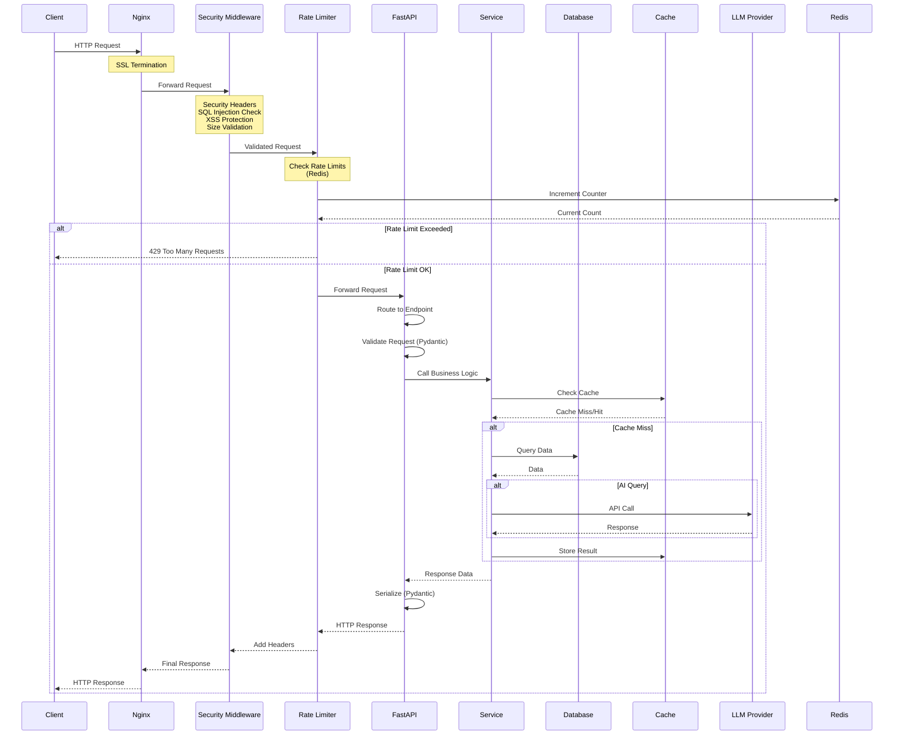
```mermaid
sequenceDiagram
    participant Client
    participant Nginx
    participant Security as Security Middleware
    participant RateLimit as Rate Limiter
    participant FastAPI
    participant Service
    participant Database
    participant Cache
    participant LLM as LLM Provider

    Client->>Nginx: HTTP Request
    Note over Nginx: SSL Termination

    Nginx->>Security: Forward Request
    Note over Security: Security Headers<br/>SQL Injection Check<br/>XSS Protection<br/>Size Validation

    Security->>RateLimit: Validated Request
    Note over RateLimit: Check Rate Limits<br/>(Redis)
    RateLimit->>Redis: Increment Counter
    Redis-->>RateLimit: Current Count

    alt Rate Limit Exceeded
        RateLimit-->>Client: 429 Too Many Requests
    else Rate Limit OK
        RateLimit->>FastAPI: Forward Request

        FastAPI->>FastAPI: Route to Endpoint
        FastAPI->>FastAPI: Validate Request (Pydantic)

        FastAPI->>Service: Call Business Logic

        Service->>Cache: Check Cache
        Cache-->>Service: Cache Miss/Hit

        alt Cache Miss
            Service->>Database: Query Data
            Database-->>Service: Data

            alt AI Query
                Service->>LLM: API Call
                LLM-->>Service: Response
            end

            Service->>Cache: Store Result
        end

        Service-->>FastAPI: Response Data
        FastAPI->>FastAPI: Serialize (Pydantic)
        FastAPI-->>RateLimit: HTTP Response
        RateLimit-->>Security: Add Headers
        Security-->>Nginx: Final Response
        Nginx-->>Client: HTTP Response
    end
```

### Request Lifecycle Steps

1. **Client Request**
   - User/app sends HTTP request to API

2. **Nginx Layer**
   - SSL/TLS termination
   - Load balancing (if multiple instances)
   - Static file serving
   - Compression

3. **Security Middleware**
   - Add security headers (X-Frame-Options, CSP, etc.)
   - Check for SQL injection patterns
   - Check for XSS patterns
   - Validate request size
   - Block malicious requests

4. **Rate Limiting**
   - Extract client identifier (API key or IP)
   - Check Redis for current usage
   - Increment counter if allowed
   - Return 429 if limit exceeded

5. **FastAPI Routing**
   - Match request to endpoint
   - Extract path/query parameters
   - Validate request with Pydantic schema

6. **Service Layer**
   - Execute business logic
   - Check cache (Redis)
   - Query database if needed
   - Call external APIs if needed
   - Return processed data

7. **Response**
   - Serialize response (Pydantic)
   - Add rate limit headers
   - Add security headers
   - Return to client

---

## Authentication & Authorization

### Authentication Flow

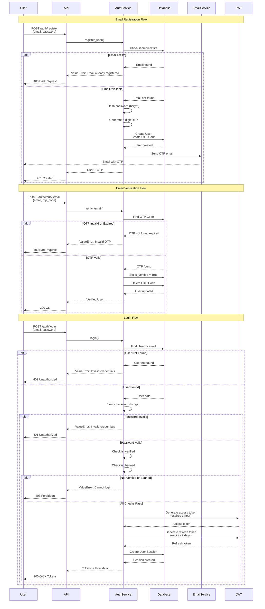
```mermaid
sequenceDiagram
    participant User
    participant API
    participant AuthService
    participant Database
    participant EmailService
    participant JWT

    Note over User,JWT: Email Registration Flow

    User->>API: POST /auth/register<br/>{email, password}
    API->>AuthService: register_user()
    AuthService->>Database: Check if email exists

    alt Email Exists
        Database-->>AuthService: Email found
        AuthService-->>API: ValueError: Email already registered
        API-->>User: 400 Bad Request
    else Email Available
        Database-->>AuthService: Email not found
        AuthService->>AuthService: Hash password (bcrypt)
        AuthService->>AuthService: Generate 6-digit OTP
        AuthService->>Database: Create User<br/>Create OTP Code
        Database-->>AuthService: User created
        AuthService->>EmailService: Send OTP email
        EmailService-->>User: Email with OTP
        AuthService-->>API: User + OTP
        API-->>User: 201 Created
    end

    Note over User,JWT: Email Verification Flow

    User->>API: POST /auth/verify-email<br/>{email, otp_code}
    API->>AuthService: verify_email()
    AuthService->>Database: Find OTP Code

    alt OTP Invalid or Expired
        Database-->>AuthService: OTP not found/expired
        AuthService-->>API: ValueError: Invalid OTP
        API-->>User: 400 Bad Request
    else OTP Valid
        Database-->>AuthService: OTP found
        AuthService->>Database: Set is_verified = True
        AuthService->>Database: Delete OTP Code
        Database-->>AuthService: User updated
        AuthService-->>API: Verified User
        API-->>User: 200 OK
    end

    Note over User,JWT: Login Flow

    User->>API: POST /auth/login<br/>{email, password}
    API->>AuthService: login()
    AuthService->>Database: Find User by email

    alt User Not Found
        Database-->>AuthService: User not found
        AuthService-->>API: ValueError: Invalid credentials
        API-->>User: 401 Unauthorized
    else User Found
        Database-->>AuthService: User data
        AuthService->>AuthService: Verify password (bcrypt)

        alt Password Invalid
            AuthService-->>API: ValueError: Invalid credentials
            API-->>User: 401 Unauthorized
        else Password Valid
            AuthService->>AuthService: Check is_verified
            AuthService->>AuthService: Check is_banned

            alt Not Verified or Banned
                AuthService-->>API: ValueError: Cannot login
                API-->>User: 403 Forbidden
            else All Checks Pass
                AuthService->>JWT: Generate access token<br/>(expires 1 hour)
                JWT-->>AuthService: Access token
                AuthService->>JWT: Generate refresh token<br/>(expires 7 days)
                JWT-->>AuthService: Refresh token
                AuthService->>Database: Create User Session
                Database-->>AuthService: Session created
                AuthService-->>API: Tokens + User data
                API-->>User: 200 OK + Tokens
            end
        end
    end
```

### Google OAuth Flow

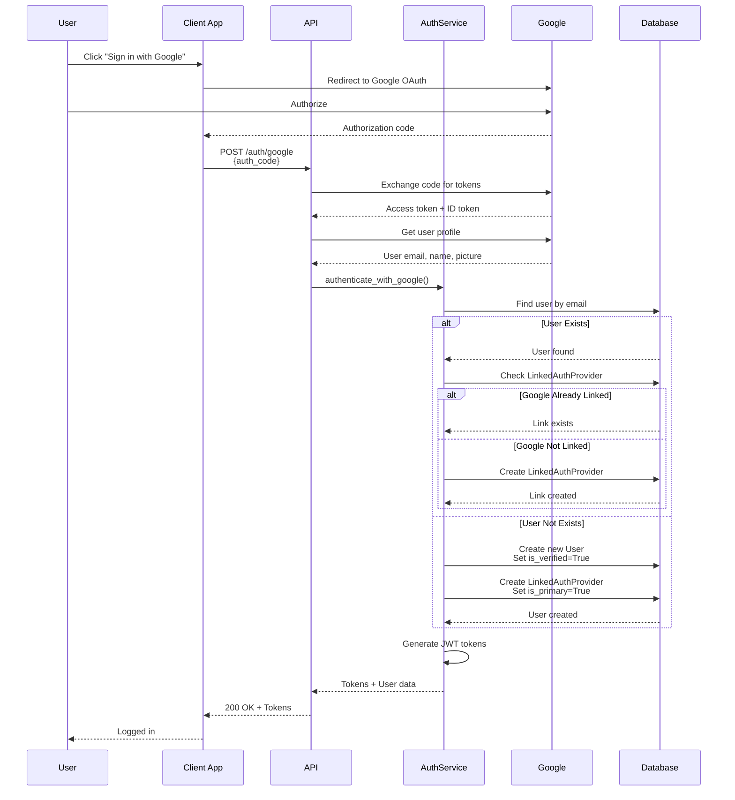
```mermaid
sequenceDiagram
    participant User
    participant Client as Client App
    participant API
    participant AuthService
    participant Google
    participant Database

    User->>Client: Click "Sign in with Google"
    Client->>Google: Redirect to Google OAuth
    User->>Google: Authorize
    Google-->>Client: Authorization code
    Client->>API: POST /auth/google<br/>{auth_code}
    API->>Google: Exchange code for tokens
    Google-->>API: Access token + ID token
    API->>Google: Get user profile
    Google-->>API: User email, name, picture
    API->>AuthService: authenticate_with_google()
    AuthService->>Database: Find user by email

    alt User Exists
        Database-->>AuthService: User found
        AuthService->>Database: Check LinkedAuthProvider

        alt Google Already Linked
            Database-->>AuthService: Link exists
        else Google Not Linked
            AuthService->>Database: Create LinkedAuthProvider
            Database-->>AuthService: Link created
        end

    else User Not Exists
        AuthService->>Database: Create new User<br/>Set is_verified=True
        AuthService->>Database: Create LinkedAuthProvider<br/>Set is_primary=True
        Database-->>AuthService: User created
    end

    AuthService->>AuthService: Generate JWT tokens
    AuthService-->>API: Tokens + User data
    API-->>Client: 200 OK + Tokens
    Client-->>User: Logged in
```

### JWT Token Structure

```json
{
  "access_token": {
    "sub": "user_id",
    "email": "user@example.com",
    "role": "user",
    "type": "access",
    "exp": 1730000000,
    "iat": 1729996400
  },
  "refresh_token": {
    "sub": "user_id",
    "type": "refresh",
    "exp": 1730604400,
    "iat": 1729996400
  }
}
```

### Authorization Roles

| Role | Permissions | Access Level |
|------|-------------|--------------|
| **user** | Basic chatbot usage, document upload | Standard |
| **moderator** | Content moderation, ticket responses | Elevated |
| **admin** | User management, full content access | High |
| **super_admin** | API key management, system configuration | Full |

---

## RAG Pipeline Architecture

### RAG System Overview

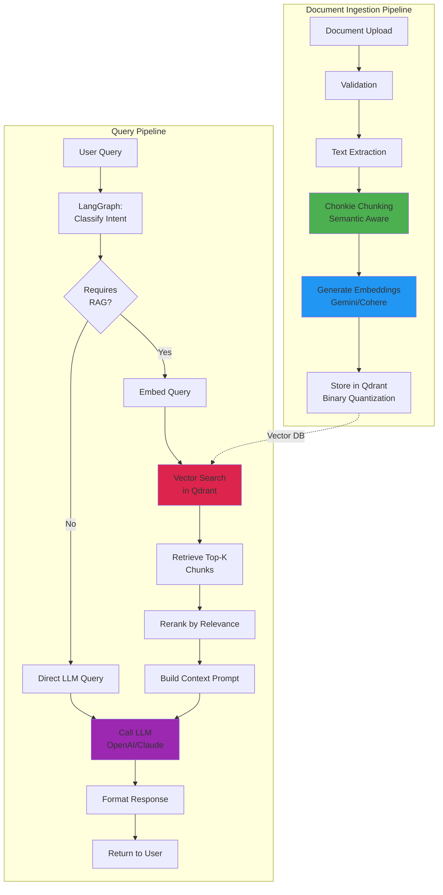
```mermaid
graph TB
    subgraph "Document Ingestion Pipeline"
        Upload[Document Upload] --> Validate[Validation]
        Validate --> Extract[Text Extraction]
        Extract --> Chunk[Chonkie Chunking<br/>Semantic Aware]
        Chunk --> Embed[Generate Embeddings<br/>Gemini/Cohere]
        Embed --> Store[Store in Qdrant<br/>Binary Quantization]
    end

    subgraph "Query Pipeline"
        Query[User Query] --> Classify[LangGraph:<br/>Classify Intent]

        Classify --> RAGPath{Requires<br/>RAG?}

        RAGPath -->|Yes| EmbedQuery[Embed Query]
        EmbedQuery --> Search[Vector Search<br/>in Qdrant]
        Search --> Retrieve[Retrieve Top-K<br/>Chunks]
        Retrieve --> Rerank[Rerank by Relevance]

        RAGPath -->|No| DirectLLM[Direct LLM Query]

        Rerank --> GeneratePrompt[Build Context Prompt]
        GeneratePrompt --> LLM[Call LLM<br/>OpenAI/Claude]
        DirectLLM --> LLM

        LLM --> Response[Format Response]
        Response --> User[Return to User]
    end

    Store -.->|Vector DB| Search

    style Chunk fill:#4CAF50
    style Embed fill:#2196F3
    style Search fill:#DC244C
    style LLM fill:#9C27B0
```

### Document Processing Flow

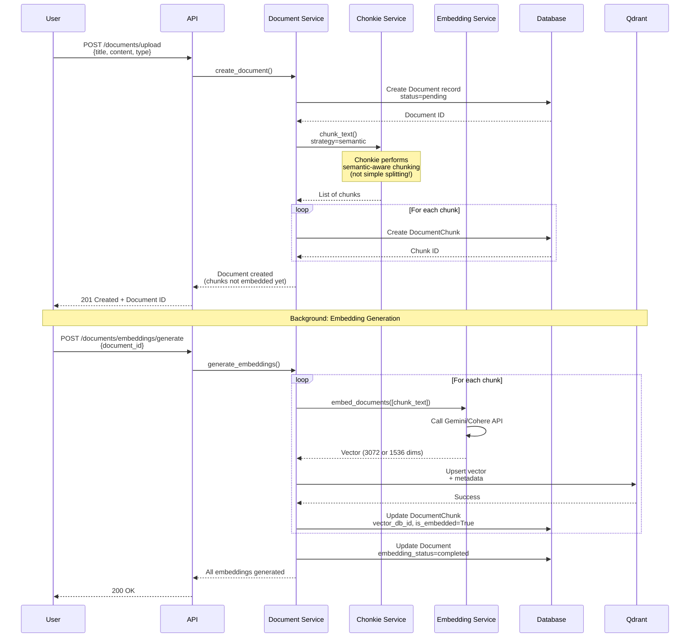
```mermaid
sequenceDiagram
    participant User
    participant API
    participant DocService as Document Service
    participant ChonkieService as Chonkie Service
    participant EmbedService as Embedding Service
    participant Database
    participant Qdrant

    User->>API: POST /documents/upload<br/>{title, content, type}
    API->>DocService: create_document()

    DocService->>Database: Create Document record<br/>status=pending
    Database-->>DocService: Document ID

    DocService->>ChonkieService: chunk_text()<br/>strategy=semantic
    Note over ChonkieService: Chonkie performs<br/>semantic-aware chunking<br/>(not simple splitting!)
    ChonkieService-->>DocService: List of chunks

    loop For each chunk
        DocService->>Database: Create DocumentChunk
        Database-->>DocService: Chunk ID
    end

    DocService-->>API: Document created<br/>(chunks not embedded yet)
    API-->>User: 201 Created + Document ID

    Note over User,Qdrant: Background: Embedding Generation

    User->>API: POST /documents/embeddings/generate<br/>{document_id}
    API->>DocService: generate_embeddings()

    loop For each chunk
        DocService->>EmbedService: embed_documents([chunk_text])
        EmbedService->>EmbedService: Call Gemini/Cohere API
        EmbedService-->>DocService: Vector (3072 or 1536 dims)

        DocService->>Qdrant: Upsert vector<br/>+ metadata
        Qdrant-->>DocService: Success

        DocService->>Database: Update DocumentChunk<br/>vector_db_id, is_embedded=True
    end

    DocService->>Database: Update Document<br/>embedding_status=completed
    DocService-->>API: All embeddings generated
    API-->>User: 200 OK
```

### Query Processing with LangGraph

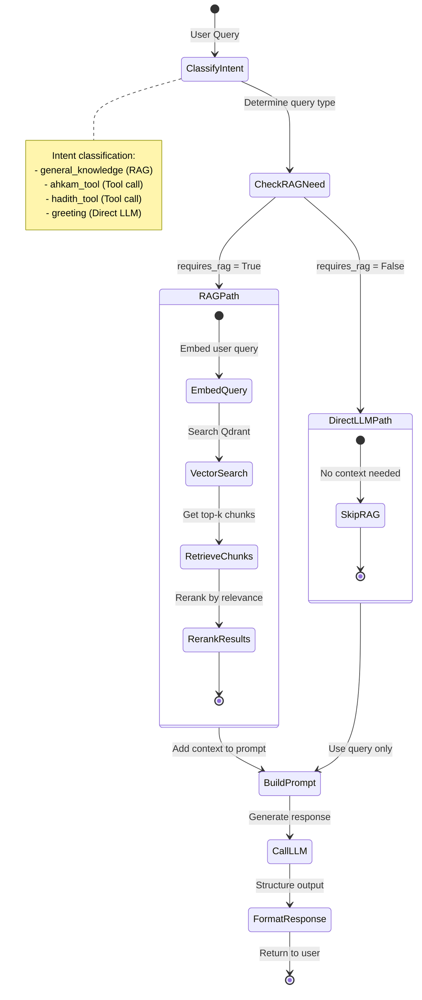
```mermaid
stateDiagram-v2
    [*] --> ClassifyIntent: User Query

    ClassifyIntent --> CheckRAGNeed: Determine query type

    CheckRAGNeed --> RAGPath: requires_rag = True
    CheckRAGNeed --> DirectLLMPath: requires_rag = False

    state RAGPath {
        [*] --> EmbedQuery: Embed user query
        EmbedQuery --> VectorSearch: Search Qdrant
        VectorSearch --> RetrieveChunks: Get top-k chunks
        RetrieveChunks --> RerankResults: Rerank by relevance
        RerankResults --> [*]
    }

    state DirectLLMPath {
        [*] --> SkipRAG: No context needed
        SkipRAG --> [*]
    }

    RAGPath --> BuildPrompt: Add context to prompt
    DirectLLMPath --> BuildPrompt: Use query only

    BuildPrompt --> CallLLM: Generate response
    CallLLM --> FormatResponse: Structure output
    FormatResponse --> [*]: Return to user

    note right of ClassifyIntent
        Intent classification:
        - general_knowledge (RAG)
        - ahkam_tool (Tool call)
        - hadith_tool (Tool call)
        - greeting (Direct LLM)
    end note
```

### LangGraph State Machine

```python
class RAGState(TypedDict):
    """State maintained throughout RAG workflow."""
    query: str                      # Original user query
    intent: str                     # Classified intent
    requires_rag: bool              # Whether to use RAG
    retrieved_chunks: list[dict]    # Retrieved document chunks
    context: str                    # Formatted context
    response: str                   # Final response
    metadata: dict                  # Additional metadata
```

### Chunking Strategy (Chonkie)

**Why Chonkie instead of LangChain text splitters?**

Traditional text splitters (CharacterTextSplitter, RecursiveCharacterTextSplitter) are **NOT semantic-aware**. They split by:
- Character count
- Token count
- Separators (newlines, periods)

**Problem**: This breaks semantic meaning!

**Chonkie** uses semantic embeddings to:
1. Analyze text semantically
2. Find natural breakpoints
3. Keep related content together
4. Respect document structure

```python
# Chonkie Semantic Chunking
chunker = SemanticChunker(
    chunk_size=512,      # Target size
    chunk_overlap=50,    # Overlap for context
    min_sentences=2      # Minimum sentences per chunk
)

# Result: Chunks that preserve meaning
chunks = chunker.chunk(text)
```

### Vector Database Configuration

**Qdrant Setup**:
```python
# Binary quantization for 40x performance
collection_config = {
    "vectors": {
        "size": 3072,  # Gemini embedding size
        "distance": "Cosine"
    },
    "quantization_config": {
        "binary": {
            "always_ram": True  # Keep in memory for speed
        }
    }
}
```

**Benefits**:
- **40x faster** search than full precision
- **32x less** memory usage
- Minimal accuracy loss (<2%)

---

## Specialized Tools System

### Tools Architecture

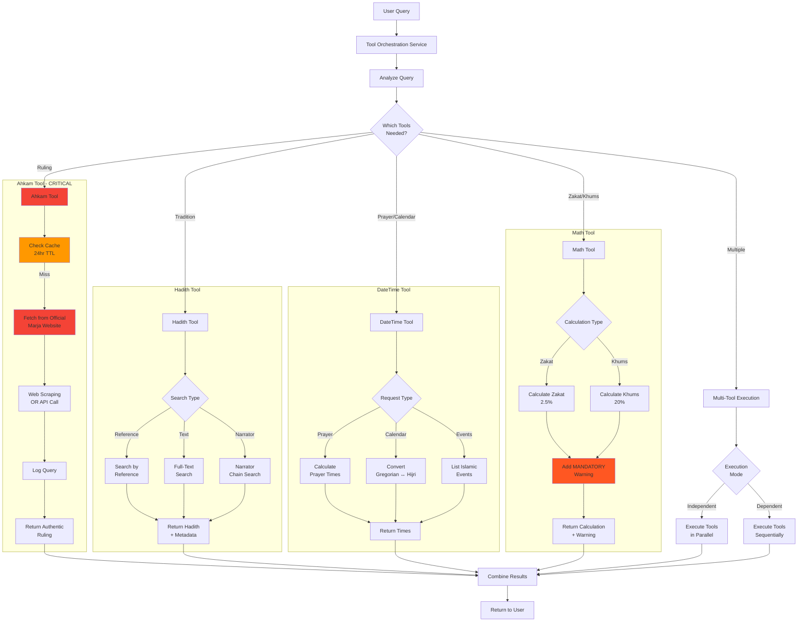
```mermaid
graph TB
    UserQuery[User Query] --> Orchestrator[Tool Orchestration Service]

    Orchestrator --> Analyze[Analyze Query]
    Analyze --> Determine{Which Tools<br/>Needed?}

    Determine -->|Ruling| AhkamTool[Ahkam Tool]
    Determine -->|Tradition| HadithTool[Hadith Tool]
    Determine -->|Prayer/Calendar| DateTimeTool[DateTime Tool]
    Determine -->|Zakat/Khums| MathTool[Math Tool]
    Determine -->|Multiple| MultiTool[Multi-Tool Execution]

    subgraph "Ahkam Tool - CRITICAL"
        AhkamTool --> CheckCache[Check Cache<br/>24hr TTL]
        CheckCache -->|Miss| FetchOfficial[Fetch from Official<br/>Marja Website]
        FetchOfficial --> WebScraping[Web Scraping<br/>OR API Call]
        WebScraping --> LogQuery[Log Query]
        LogQuery --> ReturnRuling[Return Authentic<br/>Ruling]
    end

    subgraph "Hadith Tool"
        HadithTool --> SearchType{Search Type}
        SearchType -->|Reference| RefSearch[Search by<br/>Reference]
        SearchType -->|Text| TextSearch[Full-Text<br/>Search]
        SearchType -->|Narrator| NarratorSearch[Narrator<br/>Chain Search]
        RefSearch --> HadithResult[Return Hadith<br/>+ Metadata]
        TextSearch --> HadithResult
        NarratorSearch --> HadithResult
    end

    subgraph "DateTime Tool"
        DateTimeTool --> DTType{Request Type}
        DTType -->|Prayer| PrayerTimes[Calculate<br/>Prayer Times]
        DTType -->|Calendar| ConvertDate[Convert<br/>Gregorian ↔ Hijri]
        DTType -->|Events| IslamicEvents[List Islamic<br/>Events]
        PrayerTimes --> DTResult[Return Times]
        ConvertDate --> DTResult
        IslamicEvents --> DTResult
    end

    subgraph "Math Tool"
        MathTool --> MathType{Calculation Type}
        MathType -->|Zakat| CalcZakat[Calculate Zakat<br/>2.5%]
        MathType -->|Khums| CalcKhums[Calculate Khums<br/>20%]
        CalcZakat --> AddWarning[Add MANDATORY<br/>Warning]
        CalcKhums --> AddWarning
        AddWarning --> MathResult[Return Calculation<br/>+ Warning]
    end

    MultiTool --> Parallel{Execution<br/>Mode}
    Parallel -->|Independent| ParallelExec[Execute Tools<br/>in Parallel]
    Parallel -->|Dependent| SequentialExec[Execute Tools<br/>Sequentially]

    ReturnRuling --> Combine[Combine Results]
    HadithResult --> Combine
    DTResult --> Combine
    MathResult --> Combine
    ParallelExec --> Combine
    SequentialExec --> Combine

    Combine --> FinalResponse[Return to User]

    style AhkamTool fill:#f44336
    style CheckCache fill:#FF9800
    style FetchOfficial fill:#f44336
    style AddWarning fill:#FF5722
```

### Ahkam Tool - CRITICAL DESIGN

**Why NOT use RAG for Ahkam?**

1. **Authenticity**: Islamic rulings must come from official sources
2. **Currency**: Rulings can change; RAG uses static data
3. **Authority**: Users need confidence in source authenticity
4. **Verification**: Official websites are verified by religious authorities

**How it Works**:
```python
async def get_ahkam_ruling(question: str, marja_name: str):
    # 1. Check cache (24-hour expiry)
    cached = await check_cache(question, marja_name)
    if cached:
        return cached

    # 2. Get Marja's official website config
    marja_source = await get_marja_source(marja_name)

    # 3. Fetch from official source
    if marja_source.has_official_api:
        ruling = await fetch_from_api(marja_source, question)
    else:
        ruling = await web_scraping(marja_source, question)

    # 4. Log query for monitoring
    await log_ahkam_query(question, marja_name, ruling)

    # 5. Cache result
    await cache_result(question, marja_name, ruling, ttl=86400)

    return {
        "ruling": ruling,
        "source": marja_source.official_website_url,
        "authenticity_note": "Fetched from official source"
    }
```

### Math Tool - Mandatory Warnings

```python
def get_financial_warning() -> str:
    return """
    ⚠️⚠️⚠️ CRITICAL WARNING ⚠️⚠️⚠️

    This is an APPROXIMATE calculation based on general principles.

    YOU MUST verify with:
    1. Your Marja's official office
    2. A qualified Islamic financial advisor
    3. The latest fatwas from your Marja

    Different Maraji have different rules for:
    - Calculation methods
    - Nisab thresholds
    - Exemptions and deductions
    - Payment timing

    DO NOT rely solely on this calculation for religious obligations.
    """
```

**Why Mandatory?**
- Islamic financial calculations have complex rules
- Different Maraji have different methodologies
- Users might have special circumstances
- Religious obligation requires proper consultation

### Multi-Tool Orchestration Example

**Query**: "What is the ruling on Zakat and when are prayer times in Tehran?"

**Orchestration Flow**:
```python
# 1. Query Analysis
analysis = {
    "query": "What is the ruling on Zakat and when are prayer times in Tehran?",
    "tools_needed": ["ahkam", "datetime"],
    "execution_mode": "parallel"  # Tools are independent
}

# 2. Parallel Execution
results = await asyncio.gather(
    ahkam_service.get_ahkam_ruling("Zakat ruling", "Khamenei"),
    datetime_service.get_prayer_times("Tehran", "Iran")
)

# 3. Combine Results
response = {
    "ahkam": results[0],
    "datetime": results[1],
    "tools_used": ["ahkam", "datetime"],
    "execution_time_ms": 580
}
```

---

## Database Schema

### Entity-Relationship Diagram


```mermaid
erDiagram
    USER ||--o{ USER_SESSION : has
    USER ||--o{ OTP_CODE : has
    USER ||--o{ LINKED_AUTH_PROVIDER : has
    USER ||--o{ DOCUMENT : uploads
    USER ||--o{ CONVERSATION : creates
    USER ||--o{ SUPPORT_TICKET : creates
    USER ||--o{ EXTERNAL_API_CLIENT : owns

    USER {
        uuid id PK
        string email UK
        string password_hash
        string display_name
        string role
        boolean is_verified
        boolean is_banned
        string ban_reason
        timestamp ban_expires_at
        timestamp created_at
        timestamp last_login
    }

    USER_SESSION {
        uuid id PK
        uuid user_id FK
        string refresh_token_hash
        string ip_address
        string user_agent
        timestamp expires_at
        timestamp created_at
    }

    OTP_CODE {
        uuid id PK
        uuid user_id FK
        string code_hash
        string purpose
        timestamp expires_at
        timestamp created_at
    }

    LINKED_AUTH_PROVIDER {
        uuid id PK
        uuid user_id FK
        string provider_type
        string provider_user_id
        boolean is_primary
        timestamp created_at
    }

    DOCUMENT ||--o{ DOCUMENT_CHUNK : contains
    DOCUMENT ||--o{ DOCUMENT_EMBEDDING : has

    DOCUMENT {
        uuid id PK
        uuid uploaded_by_user_id FK
        string document_type
        string source_reference
        string title
        text content
        string moderation_status
        uuid moderated_by_user_id
        timestamp moderated_at
        timestamp created_at
    }

    DOCUMENT_CHUNK {
        uuid id PK
        uuid document_id FK
        text chunk_text
        int chunk_index
        int start_char_index
        int end_char_index
        string chunking_strategy
        jsonb metadata
        timestamp created_at
    }

    DOCUMENT_EMBEDDING {
        uuid id PK
        uuid chunk_id FK
        string vector_db_type
        string vector_db_id
        string embedding_model
        int embedding_dimension
        boolean is_embedded
        timestamp created_at
    }

    CONVERSATION ||--o{ MESSAGE : contains

    CONVERSATION {
        uuid id PK
        uuid user_id FK
        string title
        timestamp created_at
        timestamp updated_at
    }

    MESSAGE {
        uuid id PK
        uuid conversation_id FK
        uuid sender_user_id FK
        string sender_type
        text content
        jsonb metadata
        timestamp created_at
    }

    MARJA ||--o{ MARJA_OFFICIAL_SOURCE : has

    MARJA {
        uuid id PK
        string full_name
        string title
        string country
        string city
        boolean is_active
        timestamp created_at
    }

    MARJA_OFFICIAL_SOURCE {
        uuid id PK
        uuid marja_id FK
        string official_website_url
        boolean has_official_api
        string api_endpoint_url
        jsonb scraping_config
        timestamp created_at
    }

    SUPPORT_TICKET ||--o{ SUPPORT_TICKET_RESPONSE : has

    SUPPORT_TICKET {
        uuid id PK
        uuid user_id FK
        string subject
        text description
        string category
        string priority
        string status
        uuid assigned_to_admin_id
        text resolution
        timestamp resolved_at
        timestamp created_at
    }

    SUPPORT_TICKET_RESPONSE {
        uuid id PK
        uuid ticket_id FK
        uuid responder_user_id FK
        text message
        boolean is_staff_response
        timestamp created_at
    }

    EXTERNAL_API_CLIENT ||--o{ EXTERNAL_API_USAGE_LOG : generates

    EXTERNAL_API_CLIENT {
        uuid id PK
        uuid owner_user_id FK
        string app_name
        text app_description
        string api_key_hash
        string api_secret_hash
        string callback_url
        jsonb allowed_origins
        int rate_limit_per_minute
        int rate_limit_per_day
        boolean is_active
        timestamp created_at
        timestamp last_used_at
    }

    EXTERNAL_API_USAGE_LOG {
        uuid id PK
        uuid client_id FK
        string endpoint
        string method
        int status_code
        int response_time_ms
        string ip_address
        timestamp timestamp
    }

    ADMIN_API_KEY {
        uuid id PK
        uuid created_by_user_id FK
        string key_name
        string key_hash
        jsonb permissions
        timestamp expires_at
        boolean is_active
        timestamp created_at
        timestamp last_used_at
    }

    ADMIN_ACTIVITY_LOG {
        uuid id PK
        uuid admin_user_id FK
        string action
        string resource_type
        uuid resource_id
        jsonb details
        timestamp timestamp
    }

    CONTENT_MODERATION_LOG {
        uuid id PK
        uuid moderator_user_id FK
        string content_type
        uuid content_id
        string action
        text reason
        timestamp timestamp
    }
```

### Key Tables and Their Purpose

| Table | Purpose | Key Relationships |
|-------|---------|-------------------|
| **users** | Core user accounts | Parent to sessions, documents, conversations |
| **user_sessions** | JWT refresh tokens, active sessions | Child of users |
| **otp_codes** | Email verification, password reset OTPs | Child of users |
| **linked_auth_providers** | Cross-platform authentication (Email ↔ Google) | Child of users |
| **documents** | Uploaded Islamic documents | Parent to chunks and embeddings |
| **document_chunks** | Chunked document pieces (Chonkie) | Child of documents, parent to embeddings |
| **document_embeddings** | Vector embeddings metadata | Child of chunks |
| **conversations** | Chat conversation threads | Parent to messages |
| **messages** | Individual chat messages | Child of conversations |
| **marja** | Islamic scholars/authorities | Parent to official sources |
| **marja_official_sources** | Official website configurations for Ahkam | Child of marja |
| **support_tickets** | User support requests | Parent to ticket responses |
| **support_ticket_responses** | Ticket conversation thread | Child of support_tickets |
| **external_api_clients** | Third-party app registrations | Parent to usage logs |
| **external_api_usage_logs** | API usage tracking | Child of external_api_clients |
| **admin_api_keys** | Super-admin API keys | Standalone |
| **admin_activity_logs** | Audit trail of admin actions | Standalone |
| **content_moderation_logs** | Content approval/rejection history | Standalone |

### Database Indexes (Performance)

**Critical Indexes**:
```sql
-- User lookups
CREATE INDEX idx_users_email ON users(email);
CREATE INDEX idx_users_is_verified ON users(is_verified);
CREATE INDEX idx_users_is_banned ON users(is_banned);

-- Document queries
CREATE INDEX idx_documents_document_type ON documents(document_type);
CREATE INDEX idx_documents_moderation_status ON documents(moderation_status);
CREATE INDEX idx_documents_type_status ON documents(document_type, moderation_status);

-- Message pagination
CREATE INDEX idx_messages_conversation_id ON messages(conversation_id);
CREATE INDEX idx_messages_conv_created ON messages(conversation_id, created_at);

-- Support ticket dashboard
CREATE INDEX idx_support_tickets_status ON support_tickets(status);
CREATE INDEX idx_tickets_status_priority ON support_tickets(status, priority);

-- API usage analytics
CREATE INDEX idx_api_usage_client_id ON external_api_usage_logs(client_id);
CREATE INDEX idx_api_usage_timestamp ON external_api_usage_logs(timestamp);
```

**Performance Impact**:
- Indexed queries: **10-100x faster**
- User email lookup: <1ms (vs 50-100ms)
- Document filtering: <5ms (vs 200-500ms)
- Message pagination: <10ms (vs 100-300ms)

---

## API Endpoints

### API Structure

```
/api/v1/
├── /auth                    # Authentication & Authorization
├── /documents               # Document Management & RAG
├── /tools                   # Specialized Islamic Tools
├── /admin                   # Admin & Moderation
├── /support                 # Support Tickets
├── /leaderboard             # User Rankings
├── /external-api            # External API Client Management
└── /asr                     # Speech-to-Text
```

### Complete Endpoint List

#### Authentication Endpoints

| Method | Endpoint | Description | Auth Required |
|--------|----------|-------------|---------------|
| POST | `/auth/register` | Register with email | No |
| POST | `/auth/verify-email` | Verify email with OTP | No |
| POST | `/auth/resend-otp` | Resend verification OTP | No |
| POST | `/auth/login` | Login with email/password | No |
| POST | `/auth/google` | Login with Google OAuth | No |
| POST | `/auth/refresh` | Refresh access token | Yes (Refresh) |
| POST | `/auth/logout` | Logout | Yes |
| POST | `/auth/password-reset/request` | Request password reset | No |
| POST | `/auth/password-reset/confirm` | Reset password with OTP | No |

#### Document & RAG Endpoints

| Method | Endpoint | Description | Auth Required |
|--------|----------|-------------|---------------|
| POST | `/documents/upload` | Upload document | Yes |
| GET | `/documents` | List documents | Yes |
| GET | `/documents/{id}` | Get document details | Yes |
| DELETE | `/documents/{id}` | Delete document | Yes |
| POST | `/documents/embeddings/generate` | Generate embeddings | Yes |
| POST | `/documents/search` | Semantic search | Yes |
| GET | `/documents/qdrant/status` | Qdrant health check | Yes |
| POST | `/documents/query` | RAG query (full pipeline) | Yes |

#### Specialized Tools Endpoints

| Method | Endpoint | Description | Auth Required |
|--------|----------|-------------|---------------|
| POST | `/tools/ahkam` | Get Ahkam ruling | Yes |
| POST | `/tools/hadith/search` | Search Hadith | Yes |
| POST | `/tools/datetime/prayer-times` | Get prayer times | Yes |
| POST | `/tools/datetime/convert` | Convert Gregorian ↔ Hijri | Yes |
| POST | `/tools/math/zakat` | Calculate Zakat | Yes |
| POST | `/tools/math/khums` | Calculate Khums | Yes |
| POST | `/tools/query` | Multi-tool orchestrated query | Yes |

#### Admin & Moderation Endpoints

| Method | Endpoint | Description | Auth Required |
|--------|----------|-------------|---------------|
| POST | `/admin/api-keys` | Create API key | Admin |
| GET | `/admin/api-keys` | List API keys | Admin |
| POST | `/admin/api-keys/{id}/revoke` | Revoke API key | Admin |
| GET | `/admin/users` | List users | Admin |
| POST | `/admin/users/{id}/ban` | Ban user | Admin |
| POST | `/admin/users/{id}/unban` | Unban user | Admin |
| POST | `/admin/users/{id}/role` | Change user role | Admin |
| GET | `/admin/content/pending` | Get pending content | Admin |
| POST | `/admin/content/{type}/{id}/moderate` | Moderate content | Admin |
| GET | `/admin/statistics` | System statistics | Admin |

#### Support Ticket Endpoints

| Method | Endpoint | Description | Auth Required |
|--------|----------|-------------|---------------|
| POST | `/support/tickets` | Create ticket | Yes |
| GET | `/support/tickets/my` | List my tickets | Yes |
| GET | `/support/tickets/all` | List all tickets | Admin |
| GET | `/support/tickets/{id}` | Get ticket details | Yes |
| POST | `/support/tickets/{id}/responses` | Add response | Yes |
| POST | `/support/tickets/{id}/assign` | Assign to admin | Admin |
| PUT | `/support/tickets/{id}/status` | Update status | Admin |
| GET | `/support/statistics` | Ticket statistics | Admin |

#### Leaderboard Endpoints

| Method | Endpoint | Description | Auth Required |
|--------|----------|-------------|---------------|
| GET | `/leaderboard/documents` | Document upload rankings | No |
| GET | `/leaderboard/chat` | Chat activity rankings | No |
| GET | `/leaderboard/conversations` | Conversation rankings | No |
| GET | `/leaderboard/overall` | Overall rankings | No |
| GET | `/leaderboard/users/{id}/statistics` | User statistics | No |
| GET | `/leaderboard/me/statistics` | My statistics | Yes |

#### External API Client Endpoints

| Method | Endpoint | Description | Auth Required |
|--------|----------|-------------|---------------|
| POST | `/external-api/clients` | Register client | Yes |
| GET | `/external-api/clients` | List clients | Yes |
| GET | `/external-api/clients/{id}` | Get client details | Yes |
| PUT | `/external-api/clients/{id}` | Update client | Yes |
| POST | `/external-api/clients/{id}/regenerate-secret` | Regenerate secret | Yes |
| POST | `/external-api/clients/{id}/deactivate` | Deactivate client | Yes |
| POST | `/external-api/clients/{id}/activate` | Activate client | Yes |
| GET | `/external-api/clients/{id}/usage` | Usage statistics | Yes |

#### Speech-to-Text Endpoints

| Method | Endpoint | Description | Auth Required |
|--------|----------|-------------|---------------|
| POST | `/asr/transcribe` | Transcribe audio | Yes |
| POST | `/asr/translate` | Translate audio to English | Yes |
| GET | `/asr/languages` | Supported languages | No |

### API Authentication

**Header-Based Authentication**:
```http
Authorization: Bearer <access_token>
```

**API Key Authentication** (for external clients):
```http
X-API-Key: pk_...
X-API-Secret: sk_...
```

### Rate Limiting Headers

**Response Headers**:
```http
X-RateLimit-Limit-Minute: 60
X-RateLimit-Limit-Day: 10000
X-RateLimit-Remaining-Minute: 45
X-RateLimit-Remaining-Day: 9523
X-RateLimit-Reset-Minute: 32
Retry-After: 32
```

---

## Service Layer

### Service Architecture

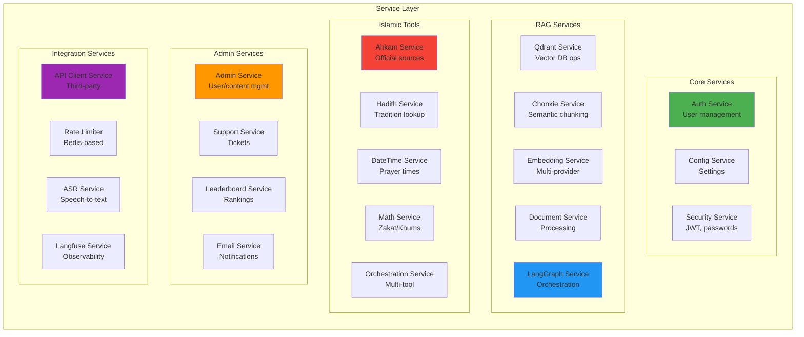
```mermaid
graph TB
    subgraph "Service Layer"
        direction TB

        subgraph "Core Services"
            AuthService[Auth Service<br/>User management]
            ConfigService[Config Service<br/>Settings]
            SecurityService[Security Service<br/>JWT, passwords]
        end

        subgraph "RAG Services"
            QdrantService[Qdrant Service<br/>Vector DB ops]
            ChonkieService[Chonkie Service<br/>Semantic chunking]
            EmbedService[Embedding Service<br/>Multi-provider]
            DocumentService[Document Service<br/>Processing]
            LangGraphService[LangGraph Service<br/>Orchestration]
        end

        subgraph "Islamic Tools"
            AhkamService[Ahkam Service<br/>Official sources]
            HadithService[Hadith Service<br/>Tradition lookup]
            DateTimeService[DateTime Service<br/>Prayer times]
            MathService[Math Service<br/>Zakat/Khums]
            OrchestrationService[Orchestration Service<br/>Multi-tool]
        end

        subgraph "Admin Services"
            AdminService[Admin Service<br/>User/content mgmt]
            SupportService[Support Service<br/>Tickets]
            LeaderboardService[Leaderboard Service<br/>Rankings]
            EmailService[Email Service<br/>Notifications]
        end

        subgraph "Integration Services"
            APIClientService[API Client Service<br/>Third-party]
            RateLimiterService[Rate Limiter<br/>Redis-based]
            ASRService[ASR Service<br/>Speech-to-text]
            LangfuseService[Langfuse Service<br/>Observability]
        end
    end

    style AuthService fill:#4CAF50
    style LangGraphService fill:#2196F3
    style AhkamService fill:#f44336
    style AdminService fill:#FF9800
    style APIClientService fill:#9C27B0
```

### Service Dependency Graph

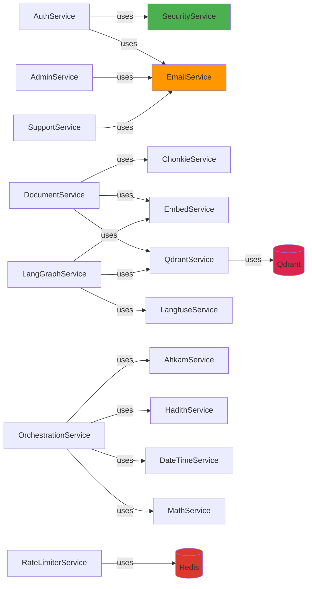
```mermaid
graph LR
    AuthService -->|uses| SecurityService
    AuthService -->|uses| EmailService

    DocumentService -->|uses| ChonkieService
    DocumentService -->|uses| EmbedService
    DocumentService -->|uses| QdrantService

    LangGraphService -->|uses| EmbedService
    LangGraphService -->|uses| QdrantService
    LangGraphService -->|uses| LangfuseService

    OrchestrationService -->|uses| AhkamService
    OrchestrationService -->|uses| HadithService
    OrchestrationService -->|uses| DateTimeService
    OrchestrationService -->|uses| MathService

    AdminService -->|uses| EmailService
    SupportService -->|uses| EmailService

    RateLimiterService -->|uses| Redis[(Redis)]
    QdrantService -->|uses| Qdrant[(Qdrant)]

    style SecurityService fill:#4CAF50
    style EmailService fill:#FF9800
    style Redis fill:#DC382D
    style Qdrant fill:#DC244C
```

### Key Service Classes

#### AuthService

```python
class AuthService:
    """Authentication and user management service."""

    async def register_user(
        email: str,
        password: str,
        display_name: str
    ) -> tuple[User, str]:
        """Register new user and generate OTP."""

    async def verify_email(
        email: str,
        otp_code: str
    ) -> User:
        """Verify email with OTP code."""

    async def login(
        email: str,
        password: str
    ) -> dict:
        """Login and return JWT tokens."""

    async def refresh_access_token(
        refresh_token: str
    ) -> dict:
        """Refresh access token."""
```

#### DocumentService

```python
class DocumentService:
    """Document processing and management."""

    async def create_document(
        title: str,
        content: str,
        document_type: str,
        uploaded_by_user_id: UUID
    ) -> Document:
        """Create document and chunk it."""

    async def generate_embeddings(
        document_id: UUID
    ) -> None:
        """Generate embeddings for all chunks."""

    async def search_documents(
        query: str,
        top_k: int = 10
    ) -> list[dict]:
        """Semantic search across documents."""
```

#### AhkamService

```python
class AhkamService:
    """Ahkam rulings from official Marja sources."""

    async def get_ahkam_ruling(
        question: str,
        marja_name: str = "Khamenei",
        user_id: Optional[UUID] = None
    ) -> dict:
        """
        CRITICAL: Fetches from official Marja website.
        NOT from RAG or stored documents.
        """

    async def _fetch_from_api(
        marja_source: MarjaOfficialSource,
        question: str
    ) -> str:
        """Fetch via official API."""

    async def _fetch_via_web_scraping(
        marja_source: MarjaOfficialSource,
        question: str
    ) -> str:
        """Fetch via web scraping."""
```

#### ToolOrchestrationService

```python
class ToolOrchestrationService:
    """Multi-tool query orchestration."""

    async def analyze_query(
        query: str
    ) -> dict:
        """Determine which tools are needed."""

    async def execute_multi_tool(
        query: str,
        tools: list[str],
        execution_mode: Literal["parallel", "sequential"] = "parallel",
        context: dict = {}
    ) -> dict:
        """Execute multiple tools and combine results."""
```

#### LangfuseService

```python
class LangfuseService:
    """LLM observability and tracing."""

    def create_trace(
        name: str,
        user_id: Optional[UUID] = None,
        session_id: Optional[str] = None,
        metadata: Optional[dict] = None
    ) -> str:
        """Create trace for request tracking."""

    def track_generation(
        trace_id: str,
        name: str,
        model: str,
        input_text: str,
        output_text: str,
        prompt_tokens: int,
        completion_tokens: int,
        total_tokens: int,
        latency_ms: int
    ) -> None:
        """Track LLM generation."""

    def track_chat_query(
        user_id: UUID,
        session_id: str,
        query: str,
        response: str,
        model: str,
        prompt_tokens: int,
        completion_tokens: int,
        latency_ms: int,
        tools_used: Optional[list[str]] = None,
        rag_chunks_retrieved: Optional[int] = None
    ) -> str:
        """Convenience method for complete chat tracking."""
```

---

## Security Architecture

### Security Layers

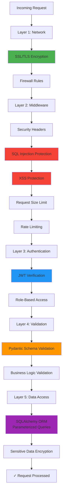
```mermaid
graph TB
    Request[Incoming Request]

    Request --> Layer1[Layer 1: Network]
    Layer1 --> SSL[SSL/TLS Encryption]
    SSL --> Firewall[Firewall Rules]

    Firewall --> Layer2[Layer 2: Middleware]
    Layer2 --> SecurityHeaders[Security Headers]
    SecurityHeaders --> SQLInjection[SQL Injection Protection]
    SQLInjection --> XSS[XSS Protection]
    XSS --> SizeLimit[Request Size Limit]
    SizeLimit --> RateLimit[Rate Limiting]

    RateLimit --> Layer3[Layer 3: Authentication]
    Layer3 --> JWTVerify[JWT Verification]
    JWTVerify --> RoleCheck[Role-Based Access]

    RoleCheck --> Layer4[Layer 4: Validation]
    Layer4 --> Pydantic[Pydantic Schema Validation]
    Pydantic --> BusinessLogic[Business Logic Validation]

    BusinessLogic --> Layer5[Layer 5: Data Access]
    Layer5 --> ORM[SQLAlchemy ORM<br/>Parameterized Queries]
    ORM --> Encryption[Sensitive Data Encryption]

    Encryption --> Success[✓ Request Processed]

    style SSL fill:#4CAF50
    style SQLInjection fill:#f44336
    style XSS fill:#f44336
    style JWTVerify fill:#2196F3
    style Pydantic fill:#FF9800
    style ORM fill:#9C27B0
```

### Security Features

#### 1. Security Headers

```python
# Added to every response
{
    "X-Content-Type-Options": "nosniff",
    "X-Frame-Options": "DENY",
    "X-XSS-Protection": "1; mode=block",
    "Strict-Transport-Security": "max-age=31536000; includeSubDomains",
    "Content-Security-Policy": "default-src 'self'",
    "Referrer-Policy": "strict-origin-when-cross-origin",
    "Permissions-Policy": "geolocation=(), microphone=(), camera=()"
}
```

#### 2. SQL Injection Protection

**Blocked Patterns**:
```regex
SELECT|INSERT|UPDATE|DELETE|DROP|CREATE|ALTER|EXEC
--|;|/*|*/
OR.*=.*|AND.*=.*
UNION.*SELECT
'.*OR.*'.*=.*'
```

**Example Blocked Request**:
```http
GET /api/v1/documents?search=test' OR '1'='1
Response: 400 Bad Request - Invalid input detected
```

#### 3. XSS Protection

**Blocked Patterns**:
```regex
<script.*>.*</script>
javascript:
onerror\s*=|onload\s*=|onclick\s*=
<iframe|<embed|<object
```

**Example Blocked Request**:
```http
POST /api/v1/support/tickets
Body: {"subject": "<script>alert('XSS')</script>"}
Response: 400 Bad Request - Invalid input detected
```

#### 4. Rate Limiting

**Default Limits**:
- **60 requests/minute** (per client)
- **10,000 requests/day** (per client)

**Implementation**:
```python
# Redis keys
rate_limit:minute:{client_id}  # TTL: 60 seconds
rate_limit:day:{client_id}:{date}  # TTL: 86400 seconds

# Response when exceeded
HTTP 429 Too Many Requests
{
    "detail": "Rate limit exceeded",
    "retry_after": 32
}
```

#### 5. Password Security

**Requirements**:
- Minimum 8 characters
- At least 1 uppercase letter
- At least 1 lowercase letter
- At least 1 number
- At least 1 special character

**Hashing**:
```python
# bcrypt with automatic salt
hashed = bcrypt.hashpw(
    password.encode('utf-8'),
    bcrypt.gensalt(rounds=12)
)
```

**Cost Factor**: 12 rounds (~300ms to hash)

#### 6. JWT Security

**Token Structure**:
```python
# Access token (1 hour expiry)
{
    "sub": "user_id",
    "email": "user@example.com",
    "role": "user",
    "type": "access",
    "exp": 1730000000,
    "iat": 1729996400
}

# Refresh token (7 days expiry)
{
    "sub": "user_id",
    "type": "refresh",
    "exp": 1730604400,
    "iat": 1729996400
}
```

**Security Measures**:
- Short-lived access tokens (1 hour)
- Long-lived refresh tokens (7 days) stored securely
- Token rotation on refresh
- Session tracking in database
- Logout invalidates refresh token

#### 7. API Key Security

**For External Clients**:
```python
# API key generation
api_key = f"pk_{secrets.token_urlsafe(32)}"
api_secret = f"sk_{secrets.token_urlsafe(48)}"

# Stored as hashes (NEVER plain text)
api_key_hash = hash_api_key(api_key)
api_secret_hash = hash_api_secret(api_secret)

# Returned ONLY ONCE on creation
{
    "api_key": "pk_...",  # SAVE THIS NOW!
    "api_secret": "sk_...",  # SAVE THIS NOW!
    "warning": "These will not be shown again!"
}
```

#### 8. Input Validation

**Pydantic Schema Example**:
```python
class RegisterRequest(BaseModel):
    email: EmailStr  # Must be valid email
    password: str = Field(min_length=8, max_length=128)
    display_name: str = Field(min_length=2, max_length=100)

    @validator('password')
    def validate_password_strength(cls, v):
        # Check uppercase, lowercase, digit, special char
        if not re.search(r'[A-Z]', v):
            raise ValueError('Password must contain uppercase')
        # ... additional checks
        return v
```

### Security Best Practices

✅ **HTTPS Only**: Strict-Transport-Security header enforces HTTPS
✅ **CORS Configured**: Only allowed origins can access API
✅ **No Sensitive Data in Logs**: Passwords, tokens never logged
✅ **Parameterized Queries**: SQLAlchemy ORM prevents SQL injection
✅ **Rate Limiting**: Prevents brute force and DoS attacks
✅ **Input Validation**: Pydantic validates all inputs
✅ **Token Expiration**: Short-lived tokens reduce risk
✅ **Audit Logging**: All admin actions logged
✅ **No Root User**: Docker containers run as non-root
✅ **Secrets in Environment**: No hardcoded credentials

---

## External API Integration

### External Client Flow

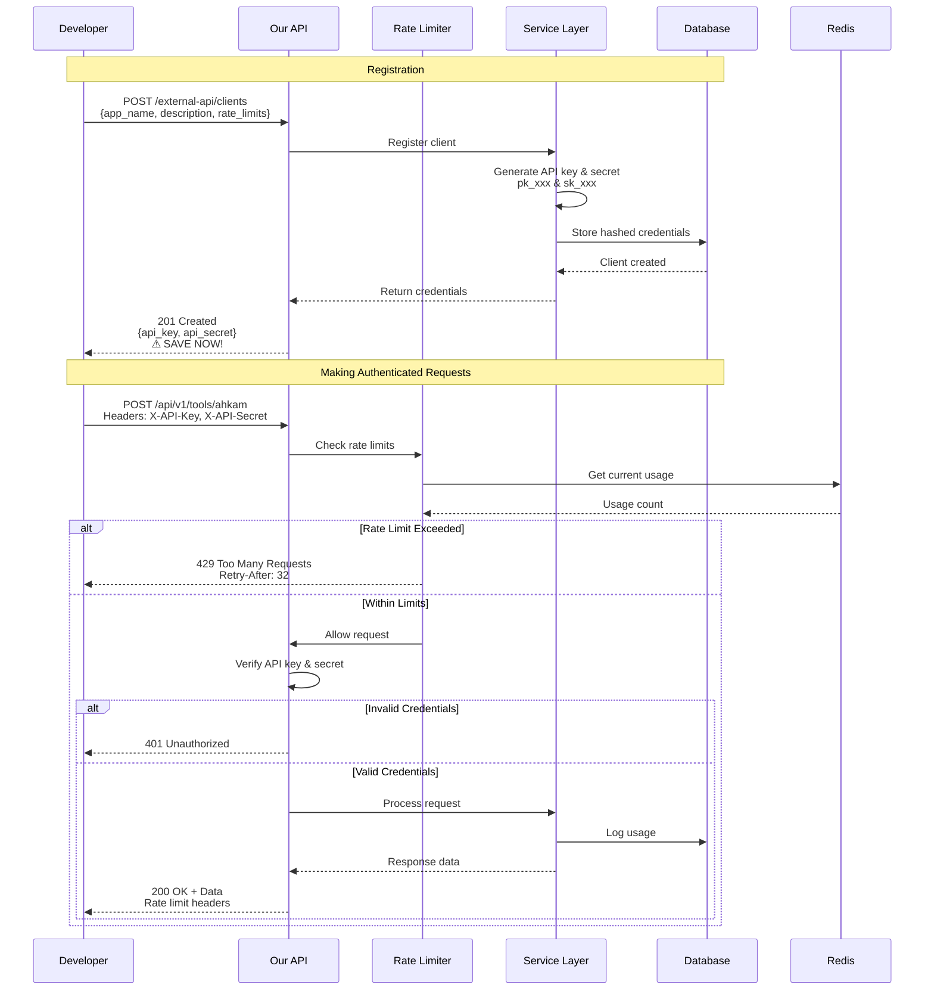
```mermaid
sequenceDiagram
    participant Dev as Developer
    participant API as Our API
    participant RateLimit as Rate Limiter
    participant Service as Service Layer
    participant DB as Database

    Note over Dev,DB: Registration

    Dev->>API: POST /external-api/clients<br/>{app_name, description, rate_limits}
    API->>Service: Register client
    Service->>Service: Generate API key & secret<br/>pk_xxx & sk_xxx
    Service->>DB: Store hashed credentials
    DB-->>Service: Client created
    Service-->>API: Return credentials
    API-->>Dev: 201 Created<br/>{api_key, api_secret}<br/>⚠️ SAVE NOW!

    Note over Dev,DB: Making Authenticated Requests

    Dev->>API: POST /api/v1/tools/ahkam<br/>Headers: X-API-Key, X-API-Secret
    API->>RateLimit: Check rate limits
    RateLimit->>Redis: Get current usage
    Redis-->>RateLimit: Usage count

    alt Rate Limit Exceeded
        RateLimit-->>Dev: 429 Too Many Requests<br/>Retry-After: 32
    else Within Limits
        RateLimit->>API: Allow request
        API->>API: Verify API key & secret

        alt Invalid Credentials
            API-->>Dev: 401 Unauthorized
        else Valid Credentials
            API->>Service: Process request
            Service->>DB: Log usage
            Service-->>API: Response data
            API-->>Dev: 200 OK + Data<br/>Rate limit headers
        end
    end
```

### API Client Registration

**Request**:
```bash
curl -X POST http://localhost:8000/api/v1/external-api/clients \
  -H "Authorization: Bearer <user_token>" \
  -H "Content-Type: application/json" \
  -d '{
    "app_name": "My Islamic App",
    "app_description": "Mobile app for Islamic education",
    "callback_url": "https://myapp.com/oauth/callback",
    "allowed_origins": ["https://myapp.com"],
    "rate_limit_per_minute": 60,
    "rate_limit_per_day": 10000
  }'
```

**Response** (credentials shown ONLY ONCE):
```json
{
  "client_id": "123e4567-e89b-12d3-a456-426614174000",
  "app_name": "My Islamic App",
  "api_key": "pk_a1b2c3d4e5f6g7h8i9j0k1l2m3n4o5p6",
  "api_secret": "sk_x9y8z7w6v5u4t3s2r1q0p9o8n7m6l5k4j3i2h1g0f9e8",
  "rate_limit_per_minute": 60,
  "rate_limit_per_day": 10000,
  "created_at": "2025-10-25T10:30:00Z",
  "warning": "⚠️ SAVE THESE CREDENTIALS NOW - They will not be shown again!"
}
```

### Using API Credentials

**Python Example**:
```python
import requests

API_KEY = "pk_..."
API_SECRET = "sk_..."

response = requests.post(
    "https://api.yourapp.com/v1/tools/ahkam",
    headers={
        "X-API-Key": API_KEY,
        "X-API-Secret": API_SECRET,
        "Content-Type": "application/json"
    },
    json={
        "question": "What is the ruling on music?",
        "marja_name": "Khamenei"
    }
)

# Check rate limits
print(f"Remaining this minute: {response.headers['X-RateLimit-Remaining-Minute']}")
print(f"Remaining today: {response.headers['X-RateLimit-Remaining-Day']}")

if response.status_code == 200:
    print(response.json())
elif response.status_code == 429:
    retry_after = response.headers['Retry-After']
    print(f"Rate limited. Retry after {retry_after} seconds")
```

**JavaScript Example**:
```javascript
const API_KEY = 'pk_...';
const API_SECRET = 'sk_...';

const response = await fetch('https://api.yourapp.com/v1/tools/ahkam', {
  method: 'POST',
  headers: {
    'X-API-Key': API_KEY,
    'X-API-Secret': API_SECRET,
    'Content-Type': 'application/json'
  },
  body: JSON.stringify({
    question: 'What is the ruling on music?',
    marja_name: 'Khamenei'
  })
});

if (response.ok) {
  const data = await response.json();
  console.log(data);
} else if (response.status === 429) {
  const retryAfter = response.headers.get('Retry-After');
  console.log(`Rate limited. Retry after ${retryAfter} seconds`);
}
```

---

## Observability & Monitoring

### Langfuse Integration

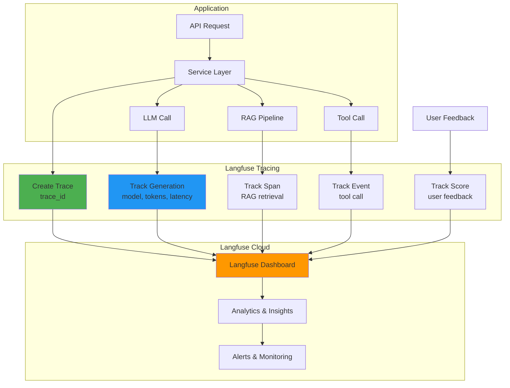
```mermaid
graph TB
    subgraph "Application"
        APIRequest[API Request]
        Service[Service Layer]
        LLM[LLM Call]
        RAG[RAG Pipeline]
        Tool[Tool Call]
    end

    subgraph "Langfuse Tracing"
        Trace[Create Trace<br/>trace_id]
        Generation[Track Generation<br/>model, tokens, latency]
        Span[Track Span<br/>RAG retrieval]
        Event[Track Event<br/>tool call]
        Score[Track Score<br/>user feedback]
    end

    subgraph "Langfuse Cloud"
        Dashboard[Langfuse Dashboard]
        Analytics[Analytics & Insights]
        Alerts[Alerts & Monitoring]
    end

    APIRequest --> Service
    Service --> Trace

    Service --> LLM
    LLM --> Generation

    Service --> RAG
    RAG --> Span

    Service --> Tool
    Tool --> Event

    User[User Feedback] --> Score

    Trace --> Dashboard
    Generation --> Dashboard
    Span --> Dashboard
    Event --> Dashboard
    Score --> Dashboard

    Dashboard --> Analytics
    Analytics --> Alerts

    style Trace fill:#4CAF50
    style Generation fill:#2196F3
    style Dashboard fill:#FF9800
```

### Complete Observability Flow

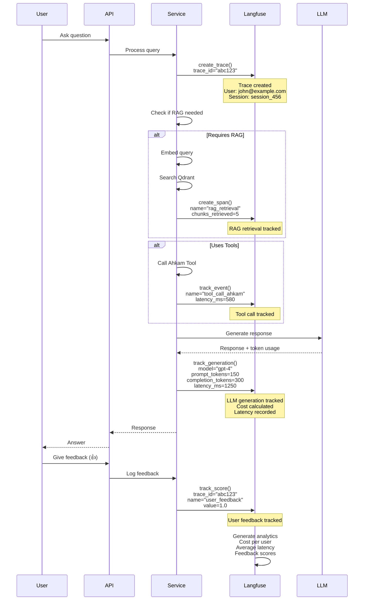
```mermaid
sequenceDiagram
    participant User
    participant API
    participant Service
    participant Langfuse
    participant LLM

    User->>API: Ask question
    API->>Service: Process query

    Service->>Langfuse: create_trace()<br/>trace_id="abc123"
    Note over Langfuse: Trace created<br/>User: john@example.com<br/>Session: session_456

    Service->>Service: Check if RAG needed

    alt Requires RAG
        Service->>Service: Embed query
        Service->>Service: Search Qdrant
        Service->>Langfuse: create_span()<br/>name="rag_retrieval"<br/>chunks_retrieved=5
        Note over Langfuse: RAG retrieval tracked
    end

    alt Uses Tools
        Service->>Service: Call Ahkam Tool
        Service->>Langfuse: track_event()<br/>name="tool_call_ahkam"<br/>latency_ms=580
        Note over Langfuse: Tool call tracked
    end

    Service->>LLM: Generate response
    LLM-->>Service: Response + token usage

    Service->>Langfuse: track_generation()<br/>model="gpt-4"<br/>prompt_tokens=150<br/>completion_tokens=300<br/>latency_ms=1250
    Note over Langfuse: LLM generation tracked<br/>Cost calculated<br/>Latency recorded

    Service-->>API: Response
    API-->>User: Answer

    User->>API: Give feedback (👍)
    API->>Service: Log feedback
    Service->>Langfuse: track_score()<br/>trace_id="abc123"<br/>name="user_feedback"<br/>value=1.0
    Note over Langfuse: User feedback tracked

    Langfuse->>Langfuse: Generate analytics<br/>Cost per user<br/>Average latency<br/>Feedback scores
```

### What Gets Tracked

| Event Type | Information Tracked | Purpose |
|------------|---------------------|---------|
| **Trace** | User ID, Session ID, Query type, Metadata | Request grouping |
| **Generation** | Model, Tokens (prompt/completion/total), Latency, Cost | LLM performance |
| **Span** | RAG retrieval, Tool calls, Cache hits | Operation timing |
| **Event** | Errors, Cache misses, API calls | Debugging |
| **Score** | User feedback (👍/👎), Quality ratings | Model evaluation |

### Langfuse Dashboard Views

**1. Overview Dashboard**:
- Total requests
- Average latency
- Total cost (by model)
- Error rate
- User satisfaction (feedback scores)

**2. Trace Explorer**:
- Individual request traces
- Full execution timeline
- Token usage per step
- Latency breakdown
- Context and responses

**3. Analytics**:
- Cost per user
- Cost per feature
- Token usage trends
- Latency percentiles (p50, p95, p99)
- Most expensive queries

**4. User Insights**:
- Active users
- Queries per user
- Average cost per user
- User satisfaction scores

### Example: Tracking a Chat Query

```python
from app.services.langfuse_service import LangfuseService

langfuse = LangfuseService()

# Complete chat query tracking
trace_id = langfuse.track_chat_query(
    user_id=user.id,
    session_id="session_789",
    query="What is the ruling on fasting during Ramadan?",
    response="According to Islamic jurisprudence...",
    model="gpt-4",
    prompt_tokens=180,
    completion_tokens=420,
    latency_ms=1450,
    tools_used=["ahkam"],
    rag_chunks_retrieved=3
)

# User gives feedback
langfuse.track_user_feedback(
    trace_id=trace_id,
    feedback_type="thumbs_up",
    value=1.0,
    comment="Very helpful answer!"
)
```

**Result in Langfuse**:
```
Trace ID: trace_abc123
├─ Generation: gpt-4
│  ├─ Prompt tokens: 180 ($0.0018)
│  ├─ Completion tokens: 420 ($0.0126)
│  ├─ Total cost: $0.0144
│  └─ Latency: 1,450ms
├─ Span: rag_retrieval
│  ├─ Chunks retrieved: 3
│  └─ Latency: 125ms
├─ Event: tool_call_ahkam
│  └─ Latency: 580ms
└─ Score: user_feedback
   ├─ Value: 1.0
   └─ Comment: "Very helpful answer!"
```

---

## Deployment Architecture

### Production Deployment Diagram

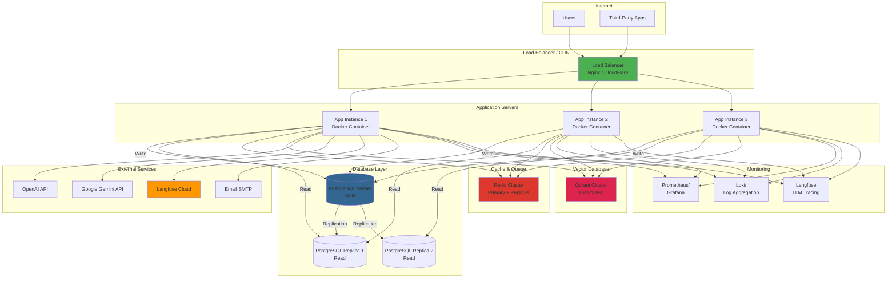
```mermaid
graph TB
    subgraph "Internet"
        Users[Users]
        ThirdParty[Third-Party Apps]
    end

    subgraph "Load Balancer / CDN"
        LB[Load Balancer<br/>Nginx / CloudFlare]
    end

    subgraph "Application Servers"
        App1[App Instance 1<br/>Docker Container]
        App2[App Instance 2<br/>Docker Container]
        App3[App Instance 3<br/>Docker Container]
    end

    subgraph "Database Layer"
        PGMaster[(PostgreSQL Master<br/>Write)]
        PGReplica1[(PostgreSQL Replica 1<br/>Read)]
        PGReplica2[(PostgreSQL Replica 2<br/>Read)]

        PGMaster -->|Replication| PGReplica1
        PGMaster -->|Replication| PGReplica2
    end

    subgraph "Cache & Queue"
        RedisCluster[Redis Cluster<br/>Primary + Replicas]
    end

    subgraph "Vector Database"
        QdrantCluster[Qdrant Cluster<br/>Distributed]
    end

    subgraph "External Services"
        OpenAI[OpenAI API]
        Gemini[Google Gemini API]
        Langfuse[Langfuse Cloud]
        SMTP[Email SMTP]
    end

    subgraph "Monitoring"
        Metrics[Prometheus/<br/>Grafana]
        Logs[Loki/<br/>Log Aggregation]
        Traces[Langfuse<br/>LLM Tracing]
    end

    Users --> LB
    ThirdParty --> LB

    LB --> App1
    LB --> App2
    LB --> App3

    App1 -->|Write| PGMaster
    App2 -->|Write| PGMaster
    App3 -->|Write| PGMaster

    App1 -->|Read| PGReplica1
    App2 -->|Read| PGReplica1
    App3 -->|Read| PGReplica2

    App1 --> RedisCluster
    App2 --> RedisCluster
    App3 --> RedisCluster

    App1 --> QdrantCluster
    App2 --> QdrantCluster
    App3 --> QdrantCluster

    App1 --> OpenAI
    App1 --> Gemini
    App1 --> Langfuse
    App1 --> SMTP

    App1 --> Metrics
    App2 --> Metrics
    App3 --> Metrics

    App1 --> Logs
    App2 --> Logs
    App3 --> Logs

    App1 --> Traces
    App2 --> Traces
    App3 --> Traces

    style LB fill:#4CAF50
    style PGMaster fill:#336791
    style RedisCluster fill:#DC382D
    style QdrantCluster fill:#DC244C
    style Langfuse fill:#FF9800
```

### Docker Deployment

**docker-compose.yml Structure**:
```yaml
services:
  app:
    build: .
    ports:
      - "8000:8000"
    environment:
      - DATABASE_URL=postgresql+asyncpg://...
      - REDIS_URL=redis://redis:6379
    depends_on:
      - postgres
      - redis
      - qdrant

  postgres:
    image: postgres:15
    volumes:
      - postgres_data:/var/lib/postgresql/data
    environment:
      - POSTGRES_PASSWORD=...

  redis:
    image: redis:7-alpine
    command: redis-server --appendonly yes
    volumes:
      - redis_data:/data

  qdrant:
    image: qdrant/qdrant:latest
    volumes:
      - qdrant_data:/qdrant/storage

  langfuse:
    image: langfuse/langfuse:latest
    environment:
      - DATABASE_URL=...
    ports:
      - "3000:3000"
```

### Scaling Strategy

**Horizontal Scaling**:
```bash
# Scale app instances
docker-compose up -d --scale app=5

# Or with Kubernetes
kubectl scale deployment islamic-chatbot-app --replicas=10
```

**Performance Targets**:
- **Single Instance**: 100+ concurrent users
- **3 Instances**: 300+ concurrent users
- **Database**: Read replicas for horizontal read scaling
- **Redis**: Cluster mode for distributed caching
- **Qdrant**: Distributed mode for large vector datasets

### Health Checks

**Application Health Endpoint**:
```python
@app.get("/health")
async def health_check():
    """Health check for load balancer."""
    return {
        "status": "healthy",
        "database": await check_database(),
        "redis": await check_redis(),
        "qdrant": await check_qdrant(),
        "timestamp": datetime.utcnow().isoformat()
    }
```

**Docker Health Check**:
```dockerfile
HEALTHCHECK --interval=30s --timeout=10s --start-period=40s --retries=3 \
  CMD python -c "import requests; requests.get('http://localhost:8000/health')"
```

---

## Key Design Decisions

### 1. Why Chonkie Instead of LangChain Text Splitters?

**Problem with Traditional Splitters**:
- Split by character count or tokens
- Break semantic meaning
- Don't respect document structure
- Poor quality chunks → Poor retrieval

**Chonkie Solution**:
- Semantic-aware chunking
- Respects sentence boundaries
- Maintains context
- Better quality chunks → Better retrieval

### 2. Why Fetch Ahkam from Official Sources (Not RAG)?

**Reasons**:
1. **Authenticity**: Islamic rulings must be authoritative
2. **Currency**: Rulings can change; RAG uses static data
3. **Trust**: Users need confidence in source
4. **Verification**: Official websites verified by religious authorities

**Trade-offs**:
- Slower (network call)
- Dependent on external website availability
- But: Worth it for authenticity

### 3. Why Binary Quantization in Qdrant?

**Benefits**:
- **40x faster** search
- **32x less** memory
- **Minimal accuracy loss** (<2%)

**How It Works**:
- Converts float32 vectors to binary
- 1536 floats (6KB) → 1536 bits (192 bytes)
- Faster comparison using bitwise operations

### 4. Why Multi-Provider Embeddings?

**Providers**:
- **Gemini**: 3072 dimensions, high quality
- **Cohere**: 1536 dimensions, faster

**Reasons**:
1. No vendor lock-in
2. Cost optimization
3. Fallback if one provider is down
4. Different models for different use cases

### 5. Why Rate Limiting with Redis?

**Why Redis?**:
- Fast in-memory operations
- Atomic increments
- TTL support (automatic expiry)
- Distributed (works across multiple app instances)

**Why Not Database?**:
- Too slow for high-frequency checks
- Higher load on database

### 6. Why Separate Refresh Tokens?

**Security Design**:
- **Access tokens**: Short-lived (1 hour), sent with every request
- **Refresh tokens**: Long-lived (7 days), stored securely

**Benefits**:
- If access token stolen: Limited damage (expires in 1 hour)
- Refresh tokens can be revoked
- Session tracking possible

### 7. Why Account Linking (Email ↔ Google)?

**User Experience**:
- User signs up with email
- Later wants to login with Google
- Without linking: Separate account created
- With linking: Same account, multiple login methods

**Implementation**:
```python
class LinkedAuthProvider:
    user_id: UUID
    provider_type: str  # "email", "google", "apple"
    provider_user_id: str
    is_primary: bool  # Original sign-up method
```

### 8. Why Langfuse for Observability?

**Alternatives Considered**:
- LangSmith (LangChain native)
- Custom logging
- APM tools (DataDog, New Relic)

**Why Langfuse?**:
1. **LLM-specific**: Designed for LLM applications
2. **Token tracking**: Automatic cost calculation
3. **Trace visualization**: See full execution flow
4. **User feedback**: Built-in feedback collection
5. **Open source**: Self-hostable
6. **LangChain integration**: Seamless integration

### 9. Why Pydantic for Validation?

**Benefits**:
1. **Automatic validation**: Type checking + constraints
2. **Clear errors**: Helpful error messages
3. **Documentation**: Auto-generates API docs
4. **Performance**: Written in Rust, very fast
5. **Standards**: JSON Schema, OpenAPI support

**Example**:
```python
class RegisterRequest(BaseModel):
    email: EmailStr  # Validates email format
    password: str = Field(min_length=8)  # Validates length

# Invalid input automatically rejected with clear error
```

### 10. Why Async/Await Throughout?

**Performance**:
- Handle 1000s of concurrent connections
- Don't block on I/O (database, API calls)
- Better resource utilization

**Example**:
```python
# Synchronous (blocks)
def get_user(user_id):
    user = db.query(User).filter(User.id == user_id).first()
    return user  # Blocks thread while waiting for DB

# Asynchronous (non-blocking)
async def get_user(user_id):
    user = await db.execute(select(User).where(User.id == user_id))
    return user.scalar_one()  # Thread free to handle other requests
```

---

## Conclusion

This document provides a complete architectural overview of the Shia Islamic Chatbot application. It covers:

✅ System overview and capabilities
✅ High-level architecture with component diagrams
✅ Complete technology stack
✅ Project structure and organization
✅ Data flow and request lifecycle
✅ Authentication flows (Email, Google OAuth)
✅ RAG pipeline with Chonkie and LangGraph
✅ Specialized tools (Ahkam, Hadith, DateTime, Math)
✅ Complete database schema
✅ All API endpoints
✅ Service layer architecture
✅ Security architecture and middleware
✅ External API integration
✅ Observability with Langfuse
✅ Deployment architecture
✅ Key design decisions and rationale

### For New Developers

To get started:
1. Read the **System Overview** section
2. Review the **High-Level Architecture** diagram
3. Understand the **Data Flow** section
4. Explore the **Service Layer** for business logic
5. Review **API Endpoints** for available functionality
6. Check **Database Schema** for data model
7. Read **Key Design Decisions** for context

### For Integrators

To integrate with this system:
1. Register for **External API Client** credentials
2. Review **API Endpoints** documentation
3. Implement **Rate Limiting** handling
4. Follow **Security** best practices
5. Use **Speech-to-Text** for voice features
6. Monitor usage with provided **statistics endpoints**

### For Operators

To deploy and maintain:
1. Follow **Deployment Architecture** guide
2. Set up **Monitoring & Observability**
3. Configure **Security** middleware
4. Implement **Scaling Strategy**
5. Monitor **Health Checks**
6. Review **Langfuse** traces regularly

---

**Document Version**: 1.0
**Last Updated**: 2025-10-25
**Maintained By**: Development Team
**License**: Proprietary

For questions or clarifications, please refer to individual phase guides (PHASE1_GUIDE.md through PHASE6_GUIDE.md).
